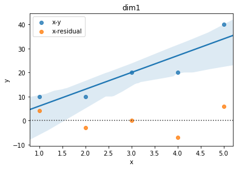

第二章画图题
----------------

* 2.14

1. 画图:

2. 如图可能有线性的关系。

3. 回归方程为

.. math ::

    y = 7 x - 1

4. 回归标准误差为 :math:`6.0553`

5. 置信区间

.. math ::

    & \beta_1 : (1.68351, 12.31649)\\
    & \beta_0 : (-18.63279, 16.63279

6. 决定系数 :math:`0.8167`

7. 方差分析:

.. math ::

     & SST = 600.0\\
     & SSE = 110.0\\
     & R^2 = 0.817\\

8. 回归检验

8. :math:`\beta_1` 的t估计量 :math:`3.65563`, :math:`1 - \alpha/2= 0.98232>0.975`, 检验通过。

9. :math:`r=0.904`

10. 残差图

.. image :: 2-14-residual.png 

11. 经计算得预测值为 :math:`28.4`.

* 2.15

1. 散点图如下

.. image :: 2-15-plot.png

2. 显然是

3. 

.. math ::

 y = 0.00359x + 0.11813

4. 标准误差 :math:`0.48`

5.

.. math ::

     & \beta_1 : (0.00263, 0.00454)\\
     & \beta_0 : (-0.68527, 0.92153)

6. 

.. math ::

    R^2 =  0.90049

7.

.. math ::

    & SST = 18.525 \\
    & SSE = 1.84338

8. :math:`\beta_1` 的t估计量 :math:`8.50858`, :math:`1 - \alpha/2=0.99999>0.975`, 检验通过。

9. :math:`r = 0.949`

10. 残差图

.. image :: 2-15-residual.png 

11. 加班时间预测为 :math:`3.703`

* 2.16

1. 散点图如下

.. image :: 2-16-plot.png

看图来说应该是可以用线性描述的。

2.

.. math ::

    y = 3.31387*x + 12112.6

3. 

normal-probability-plot:

.. image :: normal-probability-plot.png

        
     

            
    
                

            

    