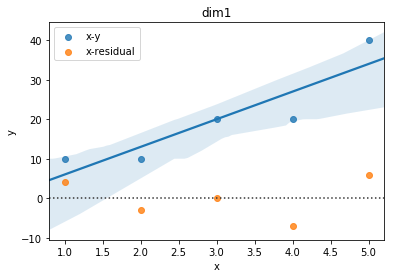

应用回归作业
==================

Chapter 2
-------------

* 2.1

一元线性回归模型有哪些基本假定?

    - 1. 高斯-马尔科夫条件。
    
    - 2. 自变量为常数。

    - 3. 正态分布。

    - 4. 回归参数个数小于方程个数。

* 2.2

.. math ::

    y_i = \beta_i + \epsilon_i, i = 1, 2, \cdots

在误差满足基本假定，但 :math:`\beta_0 = 0` 的一元线性模型中，求 :math:`\beta_1` 的最小二乘估计。

解:

列出Square Error式, 使之对 :math:`\beta_1` 导数为0 直接有

.. math ::

    \beta_1 = \frac {\sum_i^n x_i y_i} {\sum_i^n x_i^2}

* 2.3

证明满足求解条件的 :math:`\sum_{i=0}^n e_i = 0, \sum_{i=0}^n x_i e_i = 0` .

证:

.. math ::

    \sum_{i \in I} e_i 
        = \sum_{i \in I}   y_i - \hat y_i 
        = \sum_{i \in I}   (y_i - \overline y_i) + (\overline y_i - \hat y_i)
        = 0 + 0

而对于

.. math ::

    \sum_{i \in I} x_i e_i
        = \sum_{i \in I}  x_i (y_i - \hat y_i)
        = \sum_{i \in I}  x_i (y_i -  \beta_1 x_i - \beta_0 )

注意到最小二乘法求解要求上式为0， 证毕。

* 2.4

回归方程 :math:`E(y) = \beta_0 + \beta_1 x` 的参数 :math:`\beta_0, \beta_1` 的最小二乘估计与最大似然估计在什么条件下等价?

解与证明:

当满足正态条件时， :math:`y_i` 服从如下正态分布。

.. math ::

    y_i \sim N(\beta_0 + \beta_1 x_i, \sigma^2)

对应概率密度函数为    

.. math ::

    f(y_i; \theta) = \frac  1 {\sqrt{2 \pi} \sigma} exp \{ -\frac 1 {2\sigma^2} [ y_i - (\beta_0 + \beta_1 x_i) ]^2 \}

其中 :math:`\theta` 蕴含 :math:`\beta_0, \beta_1` 。

n个独立样本的最大似然

.. math ::

    L(\theta; y_1, y_2, \cdots) = \prod_{i=1}^n f(y_i, \theta)
    = {\frac  1 {\sqrt{2 \pi} \sigma}}^n exp 
    \{ -\frac 1 {2\sigma^2} \sum_{i=1}^n [ y_i - (\beta_0 + \beta_1 x_i) ]^2 \}

易得，当 :math:`\sigma` 一定，要使 :math:`L` 最大，必有项 :math:`[ y_i - (\beta_0 + \beta_1 x_i) ]^2` 最小。

上述过程可以反推，即 :math:`L` 最大时Square Error最小。

* 2.5

证明 :math:`\hat \beta_0` 是 :math:`\beta` 的无偏估计。

证:

由

.. math ::

    \overline y = \hat \beta_1 \overline x  + \hat \beta_0

且 :math:`\beta_1` 无偏, 则 

.. math ::

    E(\hat \beta_0) = E(\overline y) - \beta_1 \overline x
                    = E(\sum_{i \in I} \beta_0 + \beta_1 x_i) - \beta_1 \overline x
                    = \beta_0 + \beta_1 \overline x - \beta_1 \overline x
                    = \beta_0

* 2.6

证明

.. math ::

    var(\hat \beta_0) = [\frac 1 n + \frac {(\overline x)^2} {\sum_{i \in I} (x_i - \overline x)^2}] \sigma^2

证:

.. math ::

    var(\hat \beta_0) = var(\overline y - \hat {\beta_1} \overline x)
                      = var(\frac 1 n \sum_{i \in I} y_i) +  {\overline x}^2 var(\hat \beta_1)
                      = \frac 1 {n^2} \sum_{i \in I} var(y_i) +  {\overline x}^2 var(\hat \beta_1)

由

.. math ::

    var(\hat \beta_1) = \frac {\sigma^2} {L_{xx}}

所以

.. math ::

    var(\hat \beta_0) = \frac 1 n \sigma^2 + \frac {\sigma^2} {L_{xx}} {\overline x}^2 
                      = \sigma^2 [\frac 1 n + \frac {{\overline x}^2}  {L_{xx}}]
                      
* 2.7

证明平方和分解式 :math:`SST = SSR + SSE`.

证:

.. math ::

    SST = L_{yy} = \sum_{i \in I} (y_i - \overline y)^2 

.. math ::

    SSR = \sum_{i \in I} (\hat y_i - \overline y)^2

.. math ::

    SSE = \sum_{i \in I} (\hat y_i - y_i)^2
    

.. math ::

    [SST - (SSR + SSE)]_i 
    \triangleq  
    (y_i - \overline y)^2  - [(\hat y_i - \overline y)^2 +  (\hat y_i - y_i)^2]
    = - 2 y_i \overline y - 2 (\hat y_i)^2 + 2 \hat y_i (\overline y + y_i)

根据残差性质

.. math ::

    &\sum_{i \in I} e_i = 0 \\
    &\sum_{i \in I} x_i e_i = 0

所以

.. math :: 

    \sum_{i \in I}  & [SST - (SSR + SSE)]_i  \\
    &= \sum_{i \in I}  - 2 (\hat y_i)^2 + 2 \hat y_i y_i \\
    &= \sum_{i \in I} - 2 \hat y_i (\hat y_i - y_i) \\
    &= \sum_{i \in I} 
    - 2 \hat y_i e_i \\
    &= \sum_{i \in I} 
    (\beta_1 x_i + \beta_0) e_i \\ 
    & = 0 + 0

证毕

* 2.8

验证三种检验的关系:
    
    - t检验和回归系数检验

    .. math ::

        t = \frac {
                \hat \beta_1 \sqrt L_{xx}
            } 
            {
                \hat \sigma
            } 
          = \frac {
                \sqrt {n-2} r
            } 
            {
                \sqrt {
                    1 - r^2
                }
            }

    证:
    
    已知

    .. math ::

        & SSR = {\hat \beta_1}^2 L_{xx} \\
      
        & r = \frac {
                L_{xy}
            } 
            {   
                \sqrt{
                    L_{xx} L_{yy}
                }
            } \\ 

        & {\hat \beta_1} = 
                    \frac {
                        L_{xy}
                    }  
                    {
                        L_{xx}
                    } \\

        & SSR/SST = \frac {
                            L_{xy}^2/L_{xx}
                    } 
                    {
                        L_{yy}
                    } = r^2
    
    则

    .. math ::

      & \frac {
            \sqrt {n-2} r
        } 
        {   
            \sqrt {1 - r^2}
        }\\
          
        & = \frac{
                \sqrt{
                    \frac {
                        (n-2)SSR
                    } 
                    {
                        SST
                    }
                } 
            }
            {
                \sqrt {
                    1 - \frac {SSR} {SST}
                }
            } \\
        & = \sqrt { 
                    \frac {
                        SSR
                    }
                    {
                        SSE/(n-2)
                    }
            }\\
        & =  \frac {
                {\hat \beta_1} \sqrt L_{xx}
            }
            {
                \hat \sigma
            } = t

    其中

    - F检验和t检验

    .. math ::

        F = \frac {SSR / 1} {SSE/ (n-2)} =  \frac{\beta_1^2 \cdot L_{xx}} {\sigma^2} = t^2
    
    证明:

    在上述证明t检验和相关系数r关系的步骤中，已有
    
    .. math ::

        t = \sqrt {
            \frac {
                SSR
            }
            {
                SSE/(n-2)
            }
        } = \sqrt F

    则非常显然

    .. math ::
        
        F = t^2

    

* 2.9

验证

.. math ::

    var(e_i) = [1 
                - \frac {1} {n} 
                - \frac {
                    (x_i - \overline x)^2
                  } {  L_{xx}  } 
                ] \sigma^2
    
证:

.. math ::

    & var(e_i) = var(y_i - \hat y_i) \\
    
    & = var(y_i) + var(\hat \beta_1 x_i + \hat \beta_0) 
        - 2 cov(y_i, \hat y_i)\\

    & = \sigma^2 
        + (\frac {x_i^2 + {\overline x}^2} {L_{xx}} 
            + \frac {1}{n}
            )  \sigma^2 + 2 x_i cov(\beta_1, \beta_0)
        - 2 cov(y_i,  \hat y_i)\\

    & = \sigma^2 
        + (\frac {x_i^2 + {\overline x}^2} {L_{xx}} 
            + \frac {1}{n}
            ) - \frac  {2 x_i \overline x} {L_{xx}} \sigma^2
        - 2 cov(y_i,  \hat y_i) \\

    & = [1 +  (\frac {x_i^2 + {\overline x}^2 - {2 x_i \overline x}} {L_{xx}} 
            + \frac {1}{n}
            )] \sigma ^2
        - 2 cov(y_i,  \hat y_i)

又

.. math ::

    & \hat y_i = \hat \beta_1 x_i + \hat \beta_0 = \hat \beta_1 (x_i  - \overline x)+ \overline y \\

    & \hat \beta_1 = \sum_ij
                    \frac {
                        x_j - \overline x
                    }
                    {
                        L_{xx}
                    } y_j

    & \Rightarrow
       \hat y_i =
        (x_i  - \overline x) \sum_j
                    \frac {
                        x_j - \overline x
                    }
                    {
                        L_{xx}
                    } y_i
        + \overline y \\
    
    & \Rightarrow
        cov(y_i, \hat y_i)
            =
            (\frac {
                (x_i - \overline x)^2
            }
            {
                L_{xx}
            } + \frac {1} {n}) \sigma^2
         
    
整合得结果

* 2.10

证明 :math:`\hat \sigma^2 = \frac{1}{n-2}L_{yy}` 是 :math:`\sigma^2` 的无偏估计。

证:

由2.9得

.. math ::

    \sum_i var(e_i) = (n-2) \sigma^2

证毕

* 2.11

证明 :math:`r^2=\frac{F}{F+n-2}`

.. math ::

    & F = \frac {SSR}{SST/n-2} \\

    & \Rightarrow 
    \frac{F}{F+n-2}
    = 
    \frac{
        \frac {(n-2)SSR}{SSE} 
    }
    {
        \frac {(n-2)SSR + (n-2)SSE}{SSE} 
    }\\

    & = SSR/SSR+SSE = SSR/SST = r^2

* 2.12

如果把自变量观测值都乘以2, 回归参数的最小二乘法估计 :math:`\beta_0,\beta_1` 会发生什么变化?  

如果是加上2呢?

解:

由 :math:`\hat \beta_1, \hat \beta2` 导出式导出即可。

- 乘2
    
    :math:`\hat \beta_1` 减半  , :math:`\hat \beta_0` 不变。

- 加2

    :math:`\hat \beta_1` 不变  , :math:`\hat \beta_0` 加2。

* 2.13

相关系数大，预测误差一定小，是否正确。

解: 完全错误。

    - 首先，线性回归的求解是软优化(最小二乘法)或概率优化(最大概然)问题，不能得到确定性的结果。

    - 其次相关系数 :math:`r \Rightarrow  r^2 = SSR/(SSE + SSR)` , 可见相关系数不仅依赖于误差表征 :math:`SSR` ,还和样本数据本身的分布情况有关。
   

* 2.14

1. 画图:

2. 如图可能有线性的关系。

3. 回归方程为

.. math ::

    y = 7 x - 1

4. 回归标准误差为 :math:`0.782`

5. 置信区间

.. math ::

    & \beta_1 : (6.935, 7.065) \\
    & \beta_0 : (-1.216, -0.784)

6. 决定系数 :math:`0.8167`

7. 方差分析:

.. math ::

     & SST = 600.0\\
     & SSE = 110.0\\
     & R^2 = 0.817\\

8. 回归检验

8. :math:`\beta_1` 的t估计量 :math:`3.65563`, :math:`1 - \alpha/2= 0.98232>0.975`, 检验通过。

9. :math:`r=0.904`

10. 残差图

.. image :: 2-14-residual.png 

11. 经计算得预测值为 :math:`28.4`.

* 2.15

1. 散点图如下

.. image :: 2-15-plot.png

2. 显然是

3. 

.. math ::

 y = 0.00359x + 0.11813

4. 标准误差 :math:`0.48`

5.

.. math ::

     & \beta_1 : (0.003572, 0.003599)\\
     & \beta_0 : (0.10665, 0.12961)

6. 

.. math ::

    R^2 =  0.90049

7.

.. math ::

    & SST = 18.525 \\
    & SSE = 1.84338

8. :math:`\beta_1` 的t估计量 :math:`8.50858`, :math:`1 - \alpha/2=0.99999>0.975`, 检验通过。

9. :math:`r = 0.949`

10. 残差图

.. image :: 2-15-residual.png 

11. 加班时间预测为 :math:`3.703`

* 2.16

1. 散点图如下

.. image :: 2-16-plot.png

看图来说应该是可以用线性描述的。

2.

.. math ::

    y = 3.31387*x + 12112.6

3. 

normal-probability-plot:

.. image :: normal-probability-plot.png

        
     

            
    
                

            

    